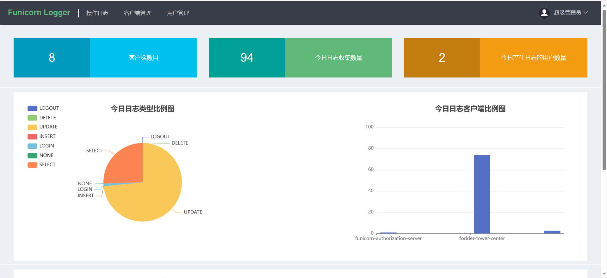
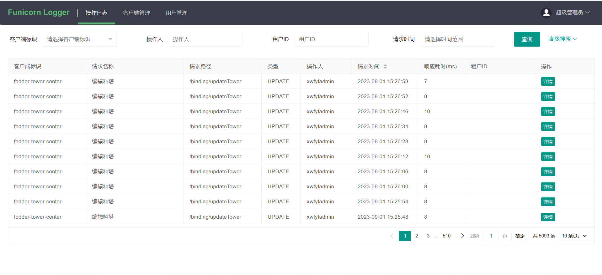
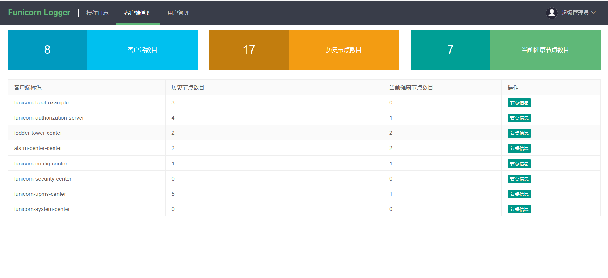

# funicorn-logger-console
##页面操作日志管理平台
通过注解的方式，记录用户操作日志；很多企业会自己搭建一个日记记录系统，原理一样，
都是通过切面的方式拦截注解方法；我额外引入了client-server模式，
client即为产生日志的各个系统，server端即为我们现在部署的这个服务，负责收集client上报上来的日志。
### 食用方式一
#### 下载源码自行编译并部署
````
1、创建数据库，执行/config目录下funicorn_logger.sql文件  
2、修改application.yml数据库配置文件  
3、启动 java -jar
````
### 食用方式二
#### 下载编译包，解压并部署
````
1、解压   
     windows：用解压软件  
     linux：tar -zxvf xxxx  
2、创建数据库，执行config目录下funicorn_logger.sql文件  
3、修改config目录下的application.yml配置文件  
4、部署  
     windows：执行win-start.bat   
     linux：./start.sh
````
###访问地址
http://ip:port

###console默认端口  
9900

###客户端连接端口：17777
````
# 客户端连接端口
funicorn:
  logger:
    admin: 
      port: 17777
````
###默认账号密码
admin/123456

### 客户端连接方式 
````
/**
 * 客户端添加maven依赖
 */
<dependency>
   <groupId>io.github.funicornframework</groupId>
   <artifactId>funicorn-logger-core</artifactId>
   <version>1.1.2</version>
</dependency>


/**
 * 创建上下文用户获取拦截器
 */
@Configuration
public class CustomUserContextProvider extends ContextUserProvider {

    @Override
    public ContextUser getContextUserDetail() {
       // 项目中的上下文
        LoginUser loginUser = SecurityUtil.getLoginUser();
        if (loginUser!=null) {
            // 设置ContextUser上下文用户信息
            ContextUser contextUser = new ContextUser();
            contextUser.setUserId(loginUser.getUserId());
            contextUser.setUsername(loginUser.getUsername());
            return contextUser;
        }
        return null;
    }
}
````

### 展示
http://139.9.72.138:9900/login  
账号密码：admin/123456  
！！！真实数据，请勿私自更改！！！ 谢谢配合
  
  


###作者联系方式
有疑问可联系作者，微信号：Funicorn_cloud  
