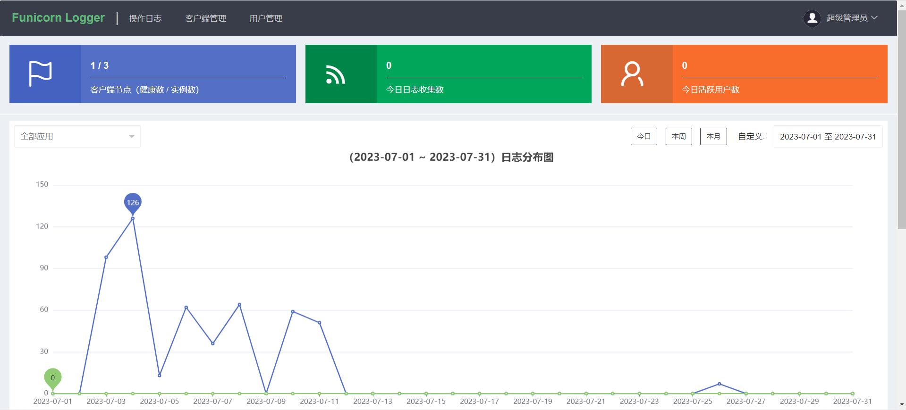
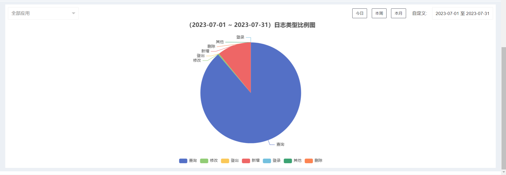
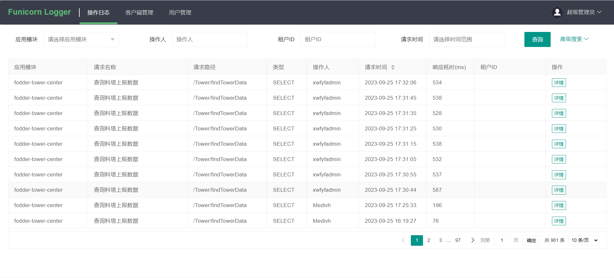
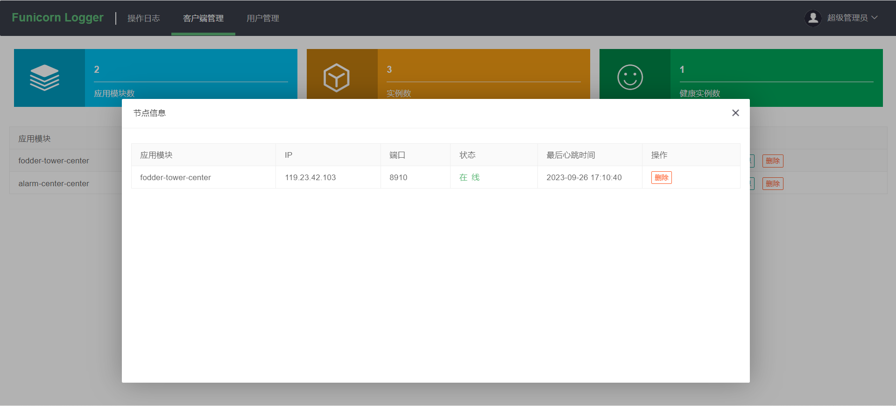
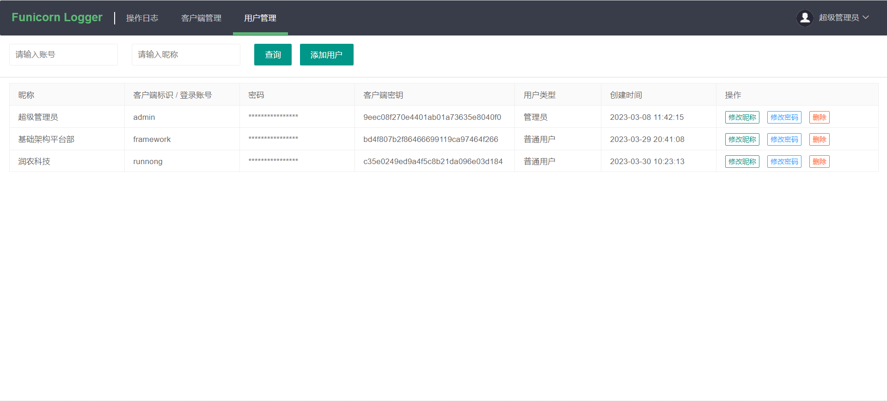

<h1 align="center" style="text-align:center;">
  funicorn-logger-console
</h1>
<p align="center">
	<strong>一站式用户操作日志收集平台</strong>
</p>

<p align="center">
    <a target="_blank" href="https://search.maven.org/artifact/org.noear/socketd">
        
    </a>
    <a target="_blank" href="https://www.apache.org/licenses/LICENSE-2.0.txt">
		
	</a>
   <a target="_blank" href="https://www.oracle.com/java/technologies/javase/javase-jdk8-downloads.html">
		</a>
	</a>
    <a target="_blank" href="https://spring.io/projects/spring-boot/">
		
	</a>
    <br />
    <a target="_blank" href='https://gitee.com/noear/socketd/stargazers'>
        
    </a>
    <a target="_blank" href='https://github.com/noear/socketd/stargazers'>
        
    </a>
</p>

<br/>
<p align="center">
	<a href="https://jq.qq.com/?_wv=1027&k=kjB5JNiC">
	</a>
     <a href="https://weixin.qq.com">
	</a>
</p>


<hr />

## 简介
通过注解的方式，记录用户操作日志；很多企业会自己搭建一个日志记录系统，原理一样，
都是通过切面的方式拦截注解方法；额外引入了client-server模式，
client即为产生日志的各个系统，server端即为我们现在部署的一站式收集平台，负责收集client上报上来的日志。
## 控制台部署
### 方式一
#### 下载源码自行编译并部署
````
1、创建数据库，执行/conf目录下funicorn_logger.sql文件  
2、修改application.yml数据库配置文件  
3、启动 java -jar
````
### 方式二
#### 下载编译包，解压并部署
````
1、解压   
2、创建数据库，再执行conf目录下funicorn_logger.sql文件  
3、修改conf目录下的application.yml配置文件  
4、启动
   将conf执行脚本放在funicorn-logger-console.jar 同目录下 
   windows：win-start.bat   
   linux：./start.sh
````
### 控制台访问地址
````
http://ip:9900  默认账号密码：admin/123456
````
### 配置服务端TCP端口
````
funicorn:
  logger:
    admin: 
      port: 17777
````
## 客户端
### 连接配置
#### 1、maven依赖
````
<dependency>
   <groupId>io.github.funicornframework</groupId>
   <artifactId>funicorn-logger-core</artifactId>
   <version>1.2.1</version>
</dependency>
````
#### 2、创建上下文拦截器
````
/**
 * 创建上下文用户获取拦截器
 */
@Configuration
public class CustomUserContextProvider extends ContextUserProvider {

    @Override
    public ContextUser getContextUserDetail() {
       // 你项目中的上下文对象
        LoginUser loginUser = SecurityUtil.getLoginUser();
        if (loginUser!=null) {
            // 设置ContextUser上下文用户信息
            ContextUser contextUser = new ContextUser();
            contextUser.setUserId(loginUser.getUserId());
            contextUser.setUsername(loginUser.getUsername());
            return contextUser;
        }
        return null;
    }
}
````
#### 3、修改配置文件
````
funicorn:
  logger: 
    # 启动或者关闭按钮 true | fasle
    enable: true
    # 服务名称（同服务名称的不同客户端为集群） 
    # 建议与 spring.application.name 保持一直
    appName: spring.application.name
    # 上下文 用户账号对应的 key，默认 username
    usernameKey: username
    # 控制台TCP连接地址
    serverAddr: ip:17777
    # 心跳间隔时间 默认 5 分钟
    keep-alive-time-minutes: 5
    client: 
      # 客户端端口 空则默认server.port，如果两处都没配置，则默认80
      port: server.port
      # 客户端连接密钥 管理员账号登录控制台 > 用户管理
      clientSecret: bd4f807b2f86466699119ca97464f266 
````

### 展示
````
http://139.9.72.138:9900/login  admin/123456  
````
#####！！！真实数据，请勿修改任何数据！！！ 谢谢配合

  


